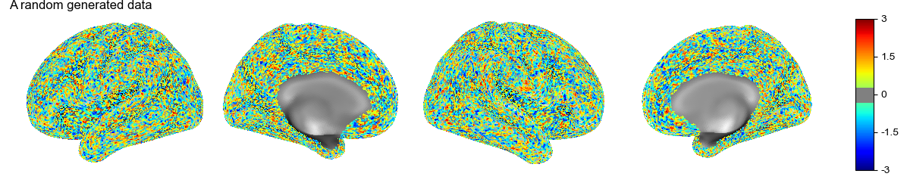
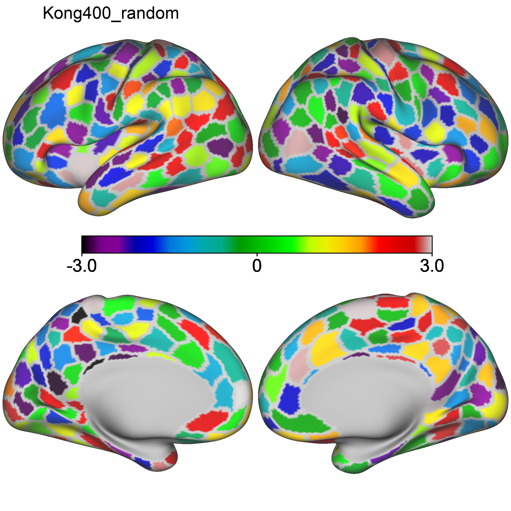

# surfplot_helper

A simple function to plot the surface data based on fsLR_32k template for both hemispheres, medial and lateral view.
This is basically the implementation from `nilearn.plotting.surf_plotting.plot_surf_stat_map` but used fsLR_32k template from [HCP-pipeline](https://github.com/Washington-University/HCPpipelines). `nilearn` only supports plotting one view at once.


The plot function is based on `nilearn` and `matplotlib` in python packages.


Below is an example. Also check `plot_example.py` for how to use it. 

``` python
############## Example one - plot fsLR_32k surface ############## 

# generate a random den-91k scalar data 
# you can read if from the .dscalar.nii file
data = np.random.uniform(low=-3, high=3, size=91282)

file_output = 'fsLR_32_surf_example.png'
cmap = 'jet'  # matplotlib compatible colormap
threshold = 0.3 # not display the value with absvalue < 0.3
figure_title = 'A random generated data'
plot_surface_data_fsLR(data, file_output, surf_type='inflated',threshold = threshold, cmap=cmap, title=figure_title)

```




``` python
############## Example two - plot kong400 parcellation ############## 

from surfplot_helper.plotting import plot_Kong_parcellation

data = np.random.uniform(low=-3, high=3, size=400)
cmap = 'nipy_spectral'
file_output = 'Kong400_random.png'
plot_Kong_parcellation(data, file_output, surf_type='inflated', cmap= cmap, title='Kong400_random', title_position=200)
```




# updates
 - v0.2.0 2024-01-09, add SchaeferKong400 parcellation plot with with workbench handling.
 - v0.1.0 2023-03-28, initial submit, only for drawing den-91k .dcalar.nii data in cifti.
